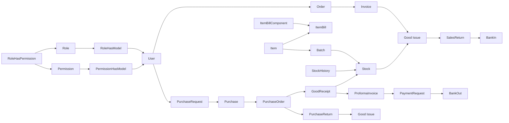

```mermaid
graph LR
%% Sales & Outbound Flow
    Order --> Invoice
    Invoice --> GoodIssue1[Good Issue]
    GoodIssue1 --> SalesReturn
    SalesReturn --> BankIn
%% Item & Inventory Management
    ItemBillComponent --> ItemBill
    Item --> ItemBill
    Item --> Batch
    Batch --> Stock
    StockHistory --> Stock
    Stock --> GoodIssue1
%% Purchasing & Inbound Flow
    PurchaseRequest --> Purchase
    Purchase --> PurchaseOrder
    PurchaseOrder --> GoodReceipt
    GoodReceipt --> Stock
    GoodReceipt --> ProformaInvoice
    ProformaInvoice --> PaymentRequest
    PaymentRequest --> BankOut
%% Returns
    PurchaseOrder --> PurchaseReturn
    PurchaseReturn --> GoodIssue2[Good Issue]
%% User Access & Permissions (RBAC)
    Role --> RoleHasModel
    RoleHasModel --> User
    RoleHasPermission --> Role
    RoleHasPermission --> Permission
    Permission --> PermissionHasModel
    PermissionHasModel --> User
%% User Interaction Initiation
    User --> PurchaseRequest
    User --> Order
```
