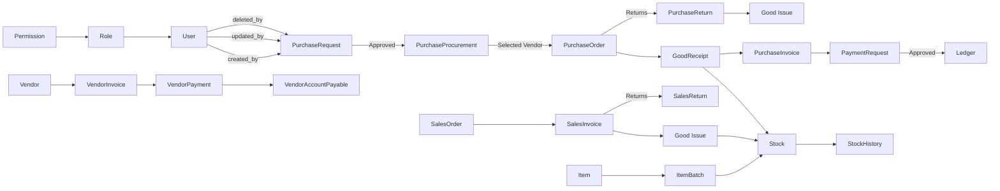

<p align="center">
  
  
  
  
</p>

# MyERP — Enterprise Backend System

**MyERP** is a **backend-only ERP system** built with **Laravel 12**, focused on **enterprise-grade business workflows**, **strict type safety**, and a **reusable approval workflow engine**.

This project demonstrates real-world ERP architecture patterns used in enterprise systems, HR platforms, and financial applications.

---

## 🎯 Project Purpose

This repository showcases:

- **Enterprise Laravel architecture** with strict coding standards
- **Database-first design** with comprehensive ERD modeling
- **Reusable approval workflow engine** used across all business modules
- **PHPStan Level 8 compliance** for maximum type safety
- **Clean, maintainable codebase** following strict conventions

> **Note:** This is not a simple CRUD demo. It reflects production-grade patterns used in real enterprise systems.

---

## 🏗️ Architecture Overview

### Model Structure & Conventions

All models follow strict conventions for consistency and maintainability:

#### Model Traits

Every model uses standardized traits for audit tracking:

- **`CreatedByTrait`** - Tracks who created the record (`created_by`)
- **`UpdatedByTrait`** - Tracks who last updated the record (`updated_by`)
- **`DeletedByTrait`** - Tracks who soft-deleted the record (`deleted_by`)
- **`HasUlids`** - Uses ULIDs instead of auto-incrementing IDs
- **`SoftDeletes`** - Enables soft deletion for data retention

#### Model Observers

Models are automatically observed for audit field population:

```php
#[ObservedBy([CreatedByObserver::class, UpdatedByObserver::class, DeletedByObserver::class])]
class YourModel extends Model
{
    use CreatedByTrait, UpdatedByTrait, DeletedByTrait, HasUlids, SoftDeletes;
}
```

#### Relationships

All relationships use explicit generic type hints for PHPStan Level 8:

```php
/**
 * @return HasMany<PurchaseRequestComponent, $this>
 */
public function components(): HasMany
{
    return $this->hasMany(PurchaseRequestComponent::class);
}

/**
 * @return BelongsTo<User, $this>
 */
public function createdBy(): BelongsTo
{
    return $this->belongsTo(User::class, 'created_by')->withTrashed();
}
```

#### Approval-Enabled Models

Models requiring approval workflows extend `ApprovalAbstract`:

```php
use App\Abstracts\ApprovalAbstract;

class PurchaseRequest extends ApprovalAbstract
{
    // Automatically includes approval event relationship
    // Implements: approve(), reject(), cancel(), rollback(), force()

    protected function onApprove(ApprovalEvent $approvalEvent): void
    {
        // Business logic executed when approval completes
    }
}
```

---

### Controller Structure & Patterns

Controllers follow a strict, standardized pattern with **NO FormRequest classes** and **inline validation**.

#### Standard Actions

Every controller implements these 7 base actions:

- **`index()`** - List resources (paginated or collection)
- **`show()`** - Display single resource
- **`store()`** - Create new resource
- **`update()`** - Update existing resource (approval models may not have this)
- **`delete()`** - Soft delete resource
- **`restore()`** - Restore soft-deleted resource
- **`destroy()`** - Permanently delete resource

#### Approval Actions

Controllers for approval-enabled models add these actions:

- **`approve()`** - Approve the workflow step
- **`reject()`** - Reject the workflow
- **`cancel()`** - Cancel pending workflow
- **`rollback()`** - Rollback completed workflow
- **`force()`** - Force execute specific step (admin override)

#### Validation Pattern

All validation is done **inline** using `$request->validate()`:

```php
public function store(Request $request): array
{
    $request->validate([
        'code' => ['required', 'string', 'max:255', new ValidationWithoutTrashed(Model::class, 'code')],
        'name' => ['required', 'string', 'max:255'],
    ]);

    // Business logic...
}
```

#### Return Types

Controllers return **arrays or Models directly** (Laravel auto-converts to JSON):

```php
/**
 * @return array{message: string, purchase_request: JsonResource}
 */
public function store(): array
{
    return [
        'message' => trans('messages.success.store'),
        'purchase_request' => $purchaseRequest->toResource(),
    ];
}
```

---

### Approval Workflow System

The approval system is a **reusable, event-driven workflow engine** that can be attached to any model.

#### How It Works

1. **Model extends `ApprovalAbstract`** - Gains approval capabilities
2. **User creates a request** - Controller calls `$model->initEvent($user)`
3. **Approval flow is initiated** - Based on configured approval dictionary
4. **Contributors approve/reject** - Each step requires specific approvers
5. **Business logic executes** - On final approval, `onApprove()` is triggered

#### Example: Purchase Request Approval Flow

```php
// User creates purchase request
$purchaseRequest->initEvent($user);

// Approvers sequentially approve
$purchaseRequest->approve($approver1);
$purchaseRequest->approve($approver2);

// On final approval, onApprove() executes
protected function onApprove(ApprovalEvent $approvalEvent): void
{
    // Automatically create Purchase Procurement
    $procurement = new PurchaseProcurement();
    $procurement->purchase_request_id = $this->id;
    $procurement->save();

    // Transfer components to procurement
    foreach ($this->components as $component) {
        // Create procurement components...
    }
}
```

#### Approval Scopes

Models automatically filter by approval status using `ApprovalAbstractScope`:

- **`withContributors()`** - Eager load approval contributors
- **`withUsers()`** - Eager load audit users (created_by, updated_by, deleted_by)

---

### Route Structure

Routes follow **explicit definition** pattern (NO `Route::resource()` or `Route::apiResource()`).

#### Standard Pattern

```php
Route::prefix('purchase')->name('purchase.')->middleware(['auth:sanctum'])->group(function () {
    Route::prefix('request')->name('request.')->middleware('can:purchase.request.index')->group(function () {
        Route::get('index', [PurchaseRequestController::class, 'index'])->name('index');
        Route::get('show/{id}', [PurchaseRequestController::class, 'show'])->name('show');
        Route::post('store', [PurchaseRequestController::class, 'store'])->name('store');
        Route::delete('delete/{id}', [PurchaseRequestController::class, 'delete'])->name('delete');
        Route::post('restore/{id}', [PurchaseRequestController::class, 'restore'])->name('restore');
        Route::delete('destroy/{id}', [PurchaseRequestController::class, 'destroy'])->name('destroy');

        // Approval actions
        Route::post('approve/{id}', [PurchaseRequestController::class, 'approve'])->name('approve');
        Route::post('reject/{id}', [PurchaseRequestController::class, 'reject'])->name('reject');
        Route::post('cancel/{id}', [PurchaseRequestController::class, 'cancel'])->name('cancel');
        Route::post('rollback/{id}', [PurchaseRequestController::class, 'rollback'])->name('rollback');
        Route::post('force/{id}', [PurchaseRequestController::class, 'force'])->name('force');
    });
});
```

#### Route Naming Convention

Routes use dot notation: `module.entity.action`

- Example: `purchase.request.store`
- Example: `vendor.invoice.approve`

---

## 🚀 Features

### Core Modules

- **Purchase Management**
    - Purchase Requests → Procurement → Orders → Invoices → Returns
    - Full approval workflow integration
    - Vendor management and payment tracking

- **Inventory Management**
    - Item master data with batch tracking
    - Stock management (Good Receipts, Good Issues)
    - Real-time stock history and adjustments

- **Vendor Management**
    - Vendor profiles and categorization
    - Account payable tracking
    - Invoice and payment processing

- **Transaction Management**
    - Payment request workflows
    - Ledger management
    - Financial transaction tracking

- **Sales Management**
    - Sales Orders → Invoices → Returns
    - Customer relationship tracking

- **Approval Workflows**
    - Configurable multi-step approval flows
    - Role/contributor-based approvals
    - Event-driven state transitions
    - Full audit trail per entity

---

## 📋 Requirements

- **PHP**: 8.4 or higher
- **MySQL**: 8.0 or higher
- **Composer**: 2.0 or higher
- **Node.js**: 18.0 or higher (for tooling)

---

## 🛠️ Installation & Setup

### 1. Clone the Repository

```bash
git clone git@github.com:menma977/MyERP.git
cd MyERP
```

### 2. Install Dependencies

```bash
composer install
```

### 3. Environment Setup

```bash
cp .env.example .env
php artisan key:generate
```

### 4. Configure Database

Update your `.env` file:

```env
DB_CONNECTION=mysql
DB_HOST=127.0.0.1
DB_PORT=3306
DB_DATABASE=myerp
DB_USERNAME=your_username
DB_PASSWORD=your_password
```

### 5. Run Migrations & Seeders

```bash
php artisan migrate --seed
```

### 6. Generate IDE Helpers (Optional)

```bash
php artisan ide-helper:generate
php artisan ide-helper:models --nowrite
```

---

## 🏃 Running the Application

### Development Server

```bash
php artisan serve
```

### With Queue Worker (Recommended)

```bash
composer run dev
```

This runs both the server and queue worker concurrently.

---

## 🧪 Testing

### Run All Tests

```bash
composer test
# or
php artisan test
```

### Run Specific Test

```bash
php artisan test --filter PurchaseRequestTest
```

### Generate Coverage Report

```bash
php artisan test --coverage
```

---

## 🔍 Code Quality & Static Analysis

### Run PHPStan (Level 8)

```bash
./vendor/bin/phpstan analyse
```

All code must pass PHPStan Level 8 for maximum type safety.

### Fix Code Style (Laravel Pint)

```bash
./vendor/bin/pint
```

Automatically formats code to PSR-12 standards.

---

## 📐 Database Design

### ERD Overview



### Database Conventions

- **Table Names**: snake_case, plural (e.g., `purchase_requests`)
- **Model Names**: PascalCase, singular (e.g., `PurchaseRequest`)
- **Foreign Keys**: `{model}_id` (e.g., `purchase_request_id`)
- **Audit Fields**: `created_by`, `updated_by`, `deleted_by` (all nullable integers)
- **Soft Deletes**: `deleted_at` timestamp on all tables
- **Primary Keys**: ULIDs (string-based, sortable, globally unique)

---

## 📚 Technology Stack

### Backend

- **Framework**: Laravel 12.0
- **PHP**: 8.4+
- **Database**: MySQL 8.0
- **Authentication**: Laravel Sanctum
- **Permissions**: Spatie Laravel Permission
- **Image Processing**: Intervention Image

### Code Quality & Tooling

- **Static Analysis**: PHPStan Level 8 (Larastan)
- **Code Style**: Laravel Pint (PSR-12)
- **Testing**: PHPUnit 11
- **Debugging**: Laradumps
- **IDE Support**: Laravel IDE Helper
- **API Docs**: Scramble (auto-generated OpenAPI docs)

---

## 🗺️ Roadmap

### Current Focus

- ✅ Core ERP modules (Purchase, Inventory, Sales, Vendors)
- ✅ Approval workflow engine
- ✅ PHPStan Level 8 compliance
- ✅ Comprehensive test coverage

### Upcoming Features

- [ ] **Multi-Tenant Support** (future goal, not yet implemented)
- [ ] Advanced reporting and analytics
- [ ] Real-time notifications
- [ ] Mobile API optimization
- [ ] Advanced caching strategies
- [ ] Queue system for heavy operations
- [ ] Performance monitoring and logging

---

## 📄 License

This project is open-sourced software licensed under the [MIT license](https://opensource.org/licenses/MIT).

---

## 🤝 Contributing

1. Fork the repository
2. Create a feature branch
3. Make your changes following project conventions
4. Run PHPStan and Pint
5. Write/update tests
6. Submit a pull request

### Development Standards

- **Follow project conventions** (see user rules/guidelines)
- **No `Route::resource()` or `Route::apiResource()`** - use explicit routes
- **No FormRequest classes** - use inline validation
- **PHPStan Level 8 must pass** - strict type safety required
- **All relationships need generic type hints**
- **All models must use standard traits and observers**

---

**Built with discipline and precision. MyERP - Enterprise-grade Laravel architecture.**
